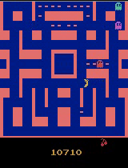

# Improved：10,710 分版本

此目錄整理自 `D:\Pacman training\pacman v0.0 - get ghost`，保留通往高分版本的主要訓練、續訓、評估與播放程式。

## 核心檔案

- `custom_wrappers.py`：第一階段高分 reward shaping。
- `ram_wrappers.py`：利用 ALE RAM 建立豆子、生命與遊戲進度訊號。
- `custom_policy.py`、`custom_policy_v2.py`：加深 CNN 與 Residual Block 實驗。
- `game_environment.py`：Atari 前處理、並行環境、checkpoint、評估、播放與錄影。
- `train_from_scratch.py`：從頭訓練流程。
- `train_strategy1.py`、`train_ram_ppo.py`、`train_wide_ppo.py`：不同 PPO 與 RAM 策略實驗。
- `train_lstm.py`、`train_lstm_v2.py`、`train_lstm_warm.py`：循環策略與 warm-start 實驗。
- `train_dqn.py`：DQN 路線實驗。
- `resume_pure_ppo.py`、`resume_death_penalty.py`：續訓與死亡懲罰版本。
- `play_local.py`：只在本機播放一局，不提交課程成績。
- `play_avg10500_v2.py`：原本用來反覆測試 final model 的腳本；上傳副本已移除固定姓名與學號。
- `models/MsPacman-v5_avg10500.zip`：保存的最終 PPO 模型。

## 已核對成果

[](../media/improved-10710.mp4)

[觀看 10,710 分完整影片](../media/improved-10710.mp4)

## 本機播放

```powershell
python -m venv .venv
.\.venv\Scripts\Activate.ps1
pip install -r requirements.txt
python play_local.py
```

需自行合法安裝 Atari ROM。除非另外設定 `PACMAN_SCORE_SERVER_URL`，`game_environment.py` 不會提交成績。

## 可選環境變數

```powershell
$env:PACMAN_PLAYER_NAME = 'player'
$env:PACMAN_STUDENT_ID = '0'
$env:PACMAN_SCORE_SERVER_URL = ''
```
